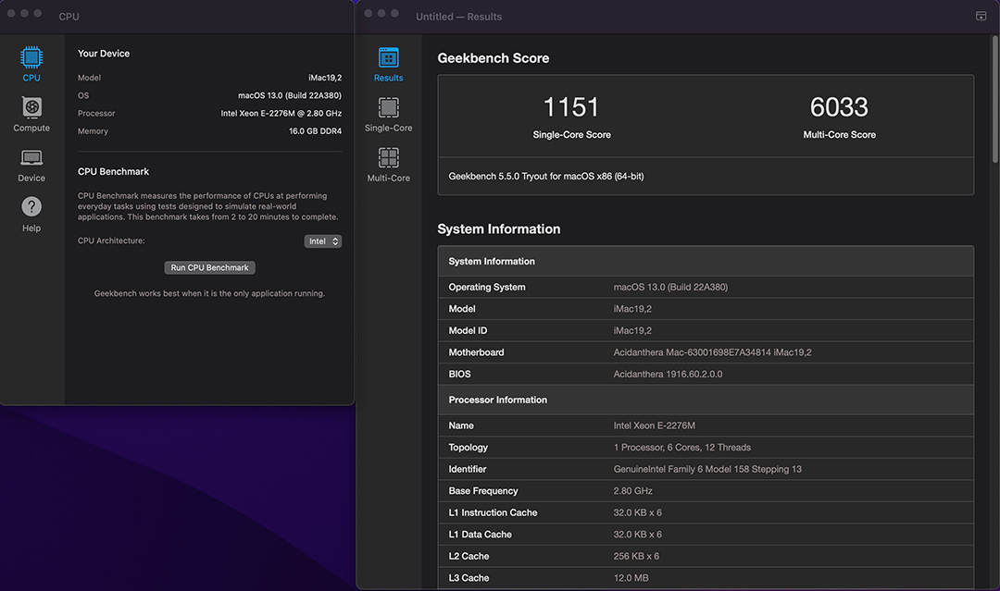

# ThinkCentre-M910s SFF Hackintosh OpenCore EFI

### [简体中文](README.zh_CN.md)

### OpenCore

[OpenCore 0.9.1](https://github.com/acidanthera/OpenCorePkg)

### OS Version Tested

- macOS Monterey 12.x
- macOS Ventura  13.x 

### Hardware

- Motherboard: Lenovo IQ270MS
- Bios Version: M1AKT51A（2021/7/6）
- CPU: Intel Xeon E2276M
- RAM: Hynix  2x8GB DDR4 2666Mhz
- SSD: West Digital SN750 500G
- iGPU: Intel UHD Graphic 630
- Audio: Realtek ALC662
- Ethernet Card: Intel L219-LM
- Wireless: BCM94360CS2 With PCIE Card
- PSU: HuntKey 180W

### Bios Setup

| Name | Option |
| ----- | --- |

### Notes
 - Use [OpenCore Configurator](https://mackie100projects.altervista.org/opencore-configurator/) build your SMBIOS
 
 - U Must Use CFGLock.efi Tool Unlock CFG LOCK first
 

### ScreenShot 

- Geekbench5 Score Intel Xeon E2276M

### Bios

SMX DIY Author [dsanke](http://www.smxdiy.com/thread-1299-1-1.html)

### Contact Us

 - QQ Group: 23304408

